# SAI Admin Dashboard

An Admin Dashboard has been developed so that admins can have full control over the application.

The home page of the application looks like this:

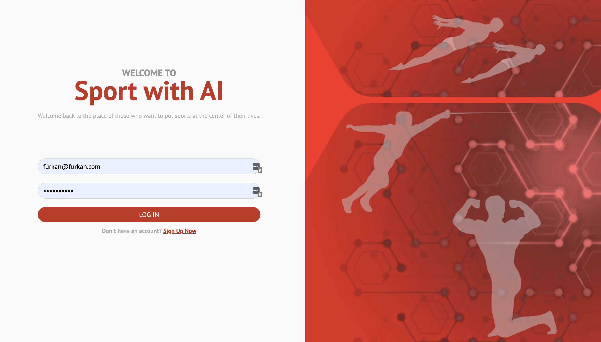

This login page will then be used within the user login page. After logging into the application, the following page will open:

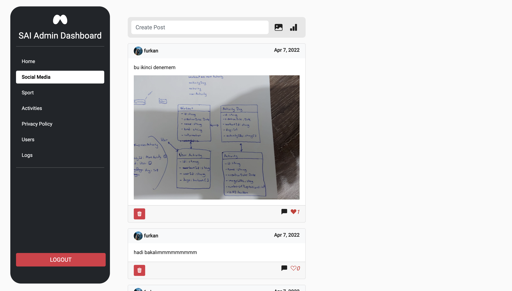

On the left we have a sidebar menu. Here, the Admin can choose the page he wants to go to according to the operation he wants to do. You can also exit the application with the logout button at the bottom.

The screenshot above belongs to the social media screen. Here the Admin can follow the posts, share the post, like the post or comment on the post.

If you want to share a new post, click on the create post field. If you want to share an image, click on the image icon, if you want to share a survey, click on the survey icon.

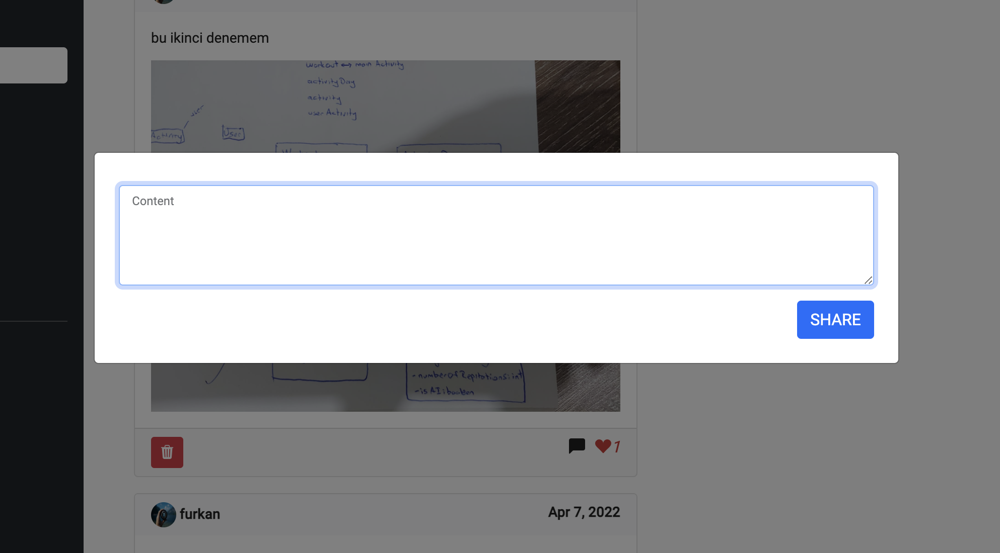

Clicking on the create post field to share a post on social media will open a popup. Here, the user can share the post on social media by entering the content they want to share and then clicking the Share button at the bottom right.

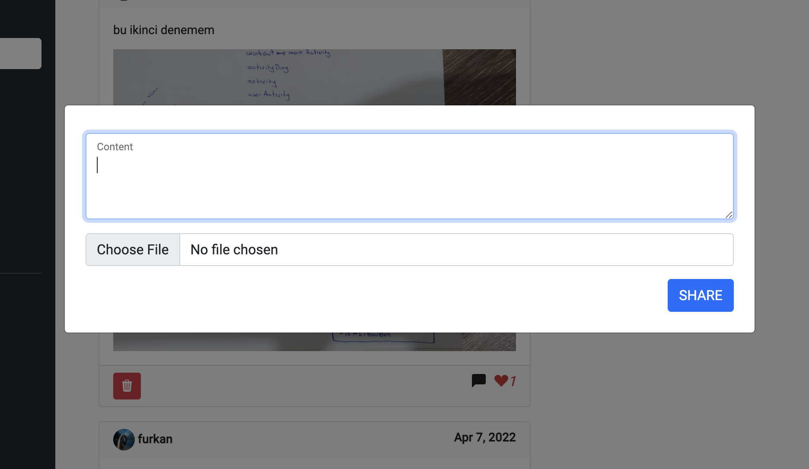

If you click on the image icon area to share an image post on social media, a popup will appear. Here, the user can share the post on social media by entering the content they want to share and selecting the image they want to share, then clicking the Share button at the bottom right.

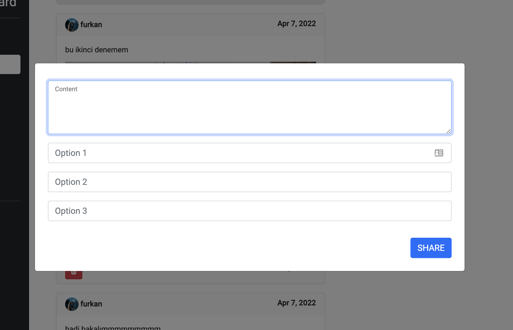

If you want to share a survey on social media, click on the survey icon. After clicking on the survey icon, a pop-up window appears in front of the user with content and options. Here, the user can share the survey on social media by entering the content and then entering the 3 options and clicking the Share button in the lower right area. After voting on the Poll, it will look like this:

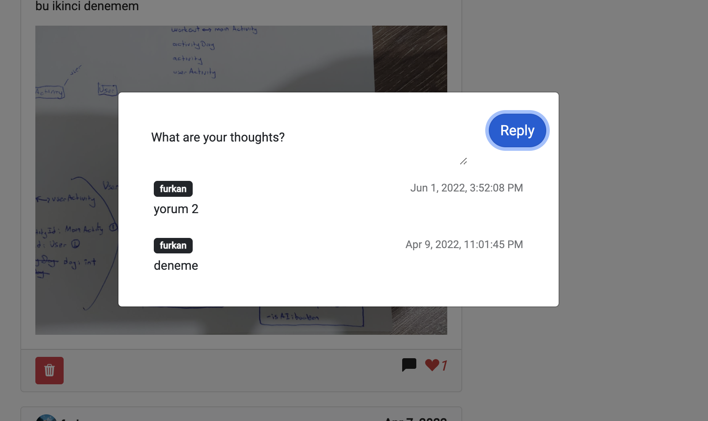

If you want to comment on a post, click on the comment icon in the post. After clicking on the comment icon, the above window opens and comes to the user. Here, you can see the comments made for that post, and you can make a new comment with the input field at the top.

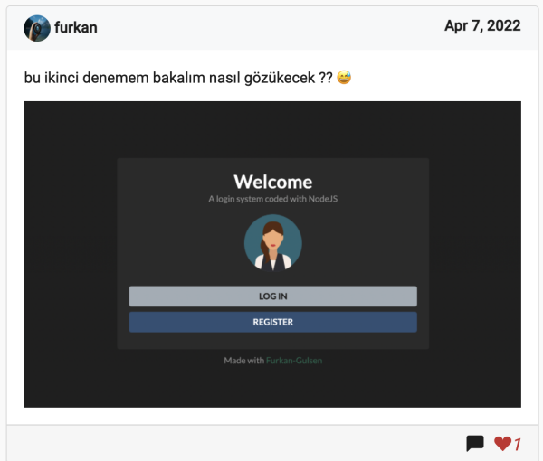

Above is a visual post on social media. There is a comment icon and a heart button at the bottom right. The user can like the post by pressing the heart button, and if he liked it, he can undo the like.

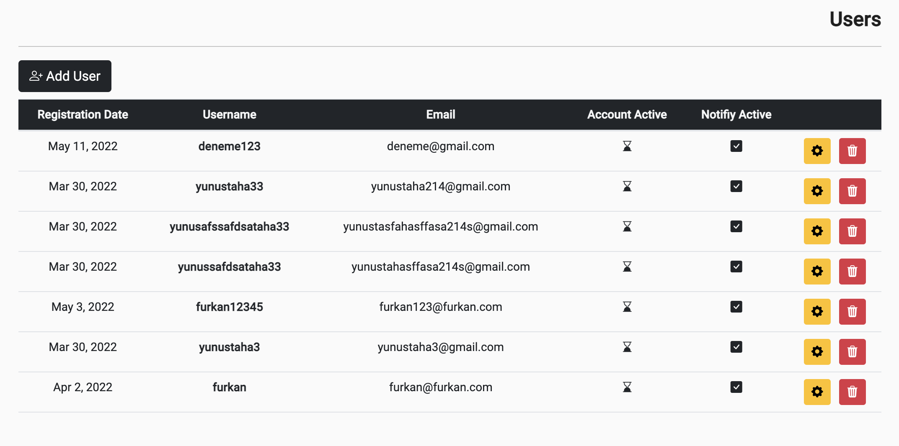

On this page, Admin can see and manage all users. You can add a new user by clicking the Add User button at the top left. This user will register directly to the system without the need for an activation code. As an administrator, there is unlimited authority on this page. Users are seen in the form of a table Click the red button to delete the user, and the yellow button to change the information about the user.

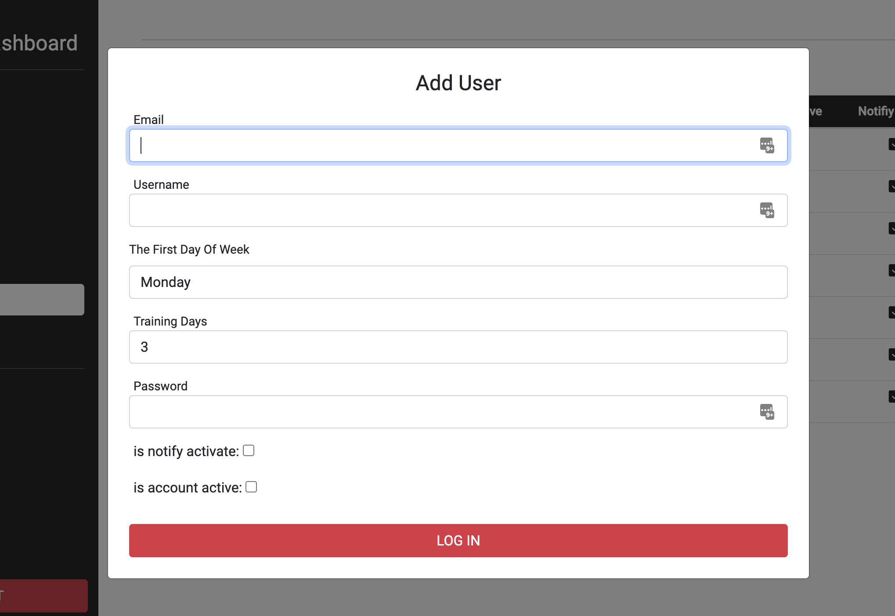

After clicking the Add User button in the upper right, this pop-up window of the Admin will open. By entering the required values here, the Admin can directly add a user to the system.

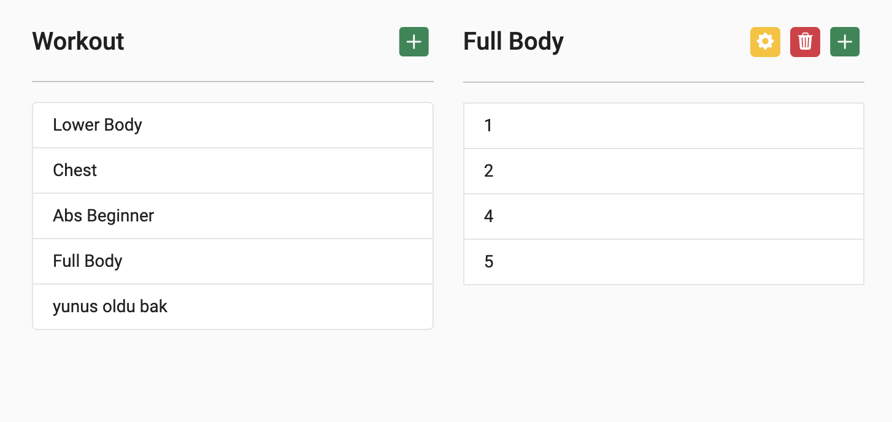

On the page above, the Admin can create a new workout by clicking the + button to the right of the Workout. You can add days to the selected workout by pressing the green button to the right of the Full Body text, and subtract days by pressing the red button. By pressing the yellow button, the selected workout can be edited.

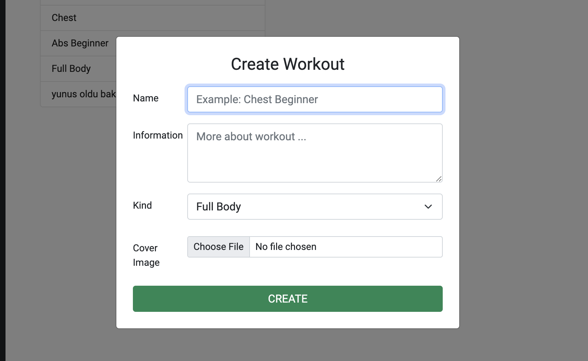

Admin can create a new workout in the pop-up window above. After entering the name, detailed information, type and finally the cover photo of the workout, pressing the Create button is enough to create a new workout.

